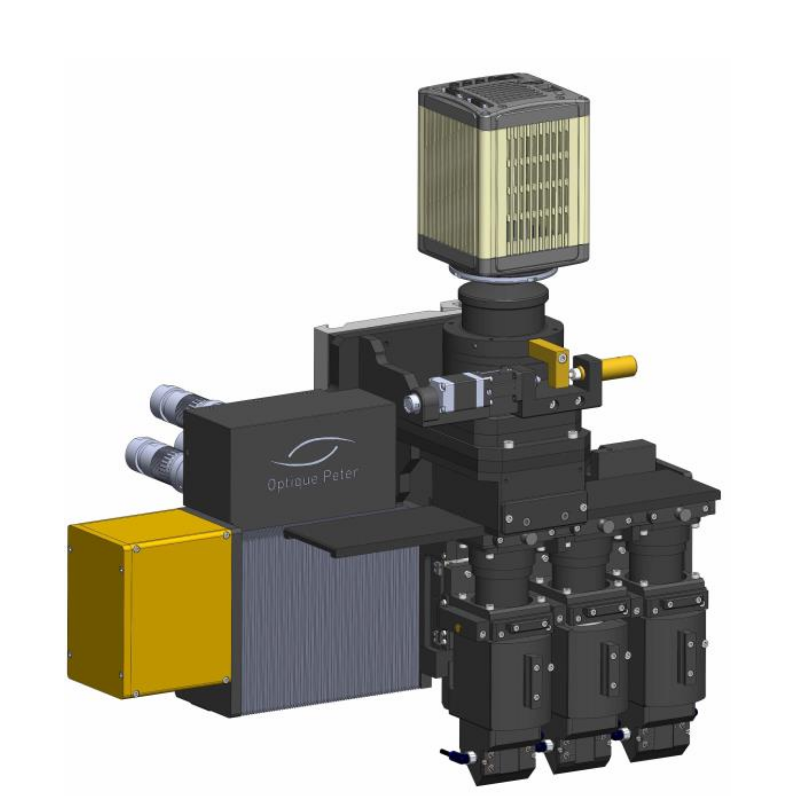

==========
Instrument
==========

Optique Peter
=============

Triple Objective
----------------

At beamline 2-BM we use a Triple Objective Microscope produced by `Optique Peter <https://optiquepeter.com/en/home/>`_

Detailed information of the instruements are:

#. `Test Report <https://anl.box.com/s/y14sqiekd4tofg4617b3vgf4ll2og41p>`_
#. `User manual <https://anl.box.com/s/fnfh2okx1wx9n3a1h2k02r9odlqpxf5z>`_
#. `Manuals <https://anl.app.box.com/folder/138012188876>`_
#. `Specs <https://anl.box.com/s/8j9pkf96bkrijataekvnpjfmw89wzfdk>`_
#. `Reference documentation <https://anl.box.com/s/ppb53bvkusbzvnx3j5ezgjsic4yetz81>`_

+--------+------------+-----------------------------+-------------------------+--------------------------+
|  Lens  | Lens Mag   |   motor position (specs)    |   ref on lens 1 (specs) |   ref on lens 1 (aligned)|
+--------+------------+-----------------------------+-------------------------+--------------------------+
|    0   |     10 x   |      121.5942               |        59.6099          |       59.0151            |
+--------+------------+-----------------------------+-------------------------+--------------------------+
|    1   |     5 x    |      61.9841                |         0.0000          |      -0.3690             |
+--------+------------+-----------------------------+-------------------------+--------------------------+
|    2   |     1.1 x  |      2.3006                 |       -59.6835          |     -59.6865             |
+--------+------------+-----------------------------+-------------------------+--------------------------+

With FLIR Oryx ORX-10G-51S5M-C 

+-----------+-----------+-----------------------------+-----------------------------------+------------+-------------+---------------------------+----------------------------+------------------------+
|    Lens   |  Lens Mag |   Pixel size (μm) (specs)   |   Pixel size (μm) (meas.)         | Pixels (H) |  Pixels (V) | Detector pixel size  (μm) |    H filed of view (mm)    |  V filed of view (mm)  |
+-----------+-----------+-----------------------------+-----------------------------------+------------+-------------+---------------------------+----------------------------+------------------------+
|      0    |    10  x  |          0.35               |     0.350787                      |     2448   |     2048    |          3.45             |         0.84               |     0.71               | 
+-----------+-----------+-----------------------------+-----------------------------------+------------+-------------+---------------------------+----------------------------+------------------------+
|      1    |    5  x   |          0.69               |     0.699447                      |     2448   |     2048    |          3.45             |         1.69               |     1.41               | 
+-----------+-----------+-----------------------------+-----------------------------------+------------+-------------+---------------------------+----------------------------+------------------------+
|      2    |    1.1 x  |          3.14               |     3.125830                      |     2448   |     2048    |          3.45             |         7.68               |     6.42               | 
+-----------+-----------+-----------------------------+-----------------------------------+------------+-------------+---------------------------+----------------------------+------------------------+

Scintillators:

+-----------+-----------+-----------------------------------+-------------------------------------+
|    Lens   |  Lens Mag |   Scintillator material           |    Scintillator thickness   (μm)    |
+-----------+-----------+-----------------------------------+-------------------------------------+
|      0    |    10  x  |            LuAG                   |                  25                 |
+-----------+-----------+-----------------------------------+-------------------------------------+
|      1    |    5  x   |            LuAG                   |                  50                 |
+-----------+-----------+-----------------------------------+-------------------------------------+
|      2    |    1.1 x  |            LuAG                   |                 100                 |
+-----------+-----------+-----------------------------------+-------------------------------------+

