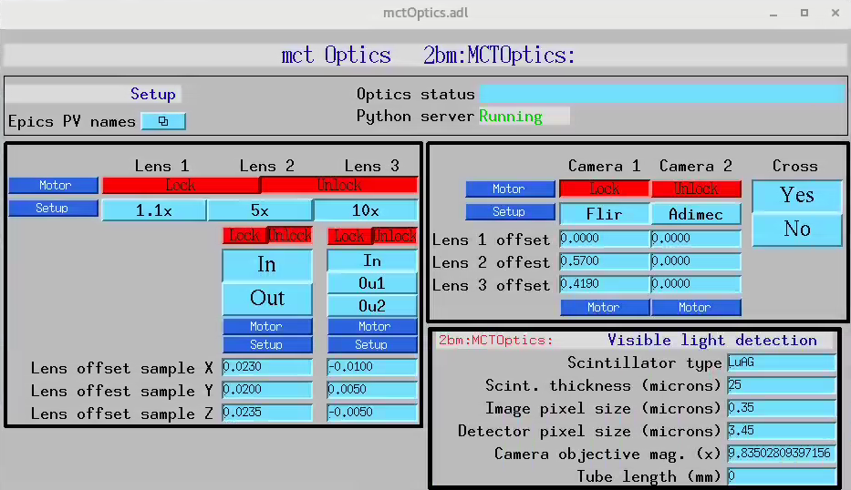
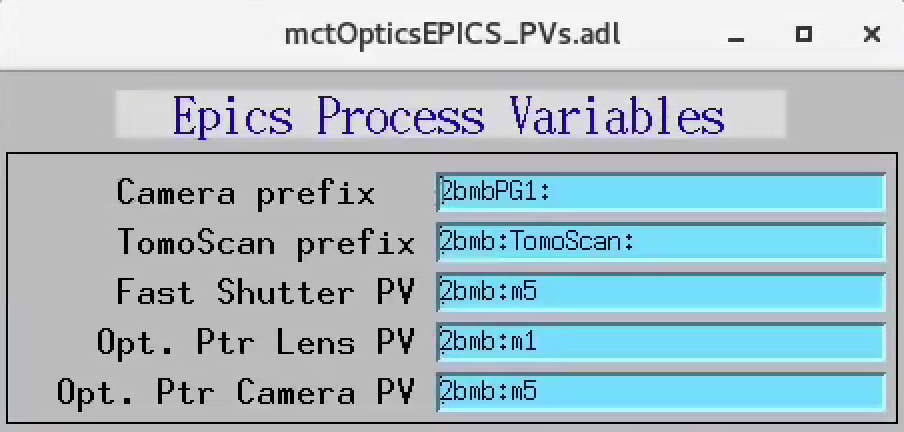

==============================
mctOpticsApp EPICS application
==============================

.. 
   toctree::
   :hidden:

   mctOptics.template
   mctOptics_settings.req
   mctOptics.substitutions

mctOptics includes a complete example EPICS application, including:

- A database file and corresponding autosave request file that contain the PVs required by the mctoptics.py base class.
- OPI screens for medm
- An example IOC application that can be used to run the above databases.
  The databases are loaded in the IOC with the example substitutions file, 
  :doc:`mctOptics.substitutions`.

Base class files
================
The following tables list all of the records in the mctOptics.template file.
These records are used by the mctoptics base class and so are required.

mctOptics.template
------------------

This is the database file that contains only the PVs required by the mctoptics.py base class
:doc:`mctOptics.template`.

TomoScan and Camera PV Prefixes
-------------------------------

.. cssclass:: table-bordered table-striped table-hover
.. list-table::
  :header-rows: 1
  :widths: 5 5 90

  * - Record name
    - Record type
    - Description
  * - $(P)$(R)CameraPVPrefix
    - stringout
    - Contains the prefix for the detector, e.g. 2bmbPG1:

Fast Shutter Select
-------------------

.. cssclass:: table-bordered table-striped table-hover
.. list-table::
  :header-rows: 1
  :widths: 5 5 90

  * - Record name
    - Record type
    - Description
  * - $(P)$(R)ShutterSelect
    - mbbo
    - Fast shutter selector for Pos0 and Pos1 position
  * - $(P)$(R)ShutterPos0
    - a0
    - Motor position for the close positiom
  * - $(P)$(R)ShutterPos1
    - a0
    - Motor position for the open positiom
  * - $(P)$(R)ShutterName0
    - a0
    - Fast shutter selector label for Pos0, e.g. Close
  * - $(P)$(R)ShutterName1
    - a0
    - Fast shutter selector label for Pos1, e.g. Open
  * - $(P)$(R)ShutterLock
    - bo
    - Fast shutter lock
  * - $(P)$(R)ShutterMotorPVName
    - stringout
    - Contains the fast shutter motor PV name, e.g. 2bmb:m5

Optique Peter camera selector
-----------------------------

.. cssclass:: table-bordered table-striped table-hover
.. list-table::
  :header-rows: 1
  :widths: 5 5 90

  * - Record name
    - Record type
    - Description
  * - $(P)$(R)CameraSelect
    - mbbo
    - Fast shutter selector for Pos0 and Pos1 position
  * - $(P)$(R)CameraPos0
    - a0
    - Motor position for the first camera
  * - $(P)$(R)CameraPos1
    - a0
    - Motor position for the second camera
  * - $(P)$(R)CameraName0
    - a0
    - Camere label for Pos0, e.g. Adimec
  * - $(P)$(R)CameraName1
    - a0
    - Camera label for Pos1, e.g. Flir
  * - $(P)$(R)CameraMotorPVName
    - stringout
    - Contains the camera motor PV name, e.g. 2bmb:m5

Optique Peter lens selector
---------------------------

.. cssclass:: table-bordered table-striped table-hover
.. list-table::
  :header-rows: 1
  :widths: 5 5 90

  * - Record name
    - Record type
    - Description
  * - $(P)$(R)LensSelect
    - mbbo
    - Lens selector for Pos0 and Pos1 position
  * - $(P)$(R)LensPos0
    - a0
    - Motor position for the first lens
  * - $(P)$(R)LensPos1
    - a0
    - Motor position for the second lens
  * - $(P)$(R)LensPos2
    - a0
    - Motor position for the third lens
  * - $(P)$(R)LensName0
    - a0
    - Lens label for Pos0, e.g. Lens0
  * - $(P)$(R)LensName1
    - a0
    - Lens label for Pos1, e.g. Lens1
  * - $(P)$(R)LensName2
    - a0
    - Lens label for Pos2, e.g. lens2
  * - $(P)$(R)LensMotorPVName
    - stringout
    - Contains the Lens motor PV name, e.g. 2bmb:m1

Lens name
^^^^^^^^^

.. cssclass:: table-bordered table-striped table-hover
.. list-table::
  :header-rows: 1
  :widths: 5 5 90

  * - Record name
    - Record type
    - Description
  * - $(P)$(R)Lens0Name
    - stringout
    - Lens name for Lens0, e.g. 1.1x
  * - $(P)$(R)Lens1Name
    - stringout
    - Lens name for Lens1, e.g. 5x
  * - $(P)$(R)Lens2Name
    - stringout
    - Lens name for Lens2, e.g. 10x

Optics information
^^^^^^^^^^^^^^^^^^

.. cssclass:: table-bordered table-striped table-hover
.. list-table::
  :header-rows: 1
  :widths: 5 5 90

  * - Record name
    - Record type
    - Description
  * - $(P)$(R)ScintillatorType
    - stringout
    - Contains the type of scintillator being used.
  * - $(P)$(R)ScintillatorThickness
    - ao
    - Contains the thickness of the scintillator in microns.
  * - $(P)$(R)ImagePixelSize
    - ao
    - Contains the pixel size on the sample in microns (i.e. includes objective magnification)
  * - $(P)$(R)DetectorPixelSize
    - ao
    - Contains the pixel size of the detector.
  * - $(P)$(R)CameraObjective
    - stringout
    - Description of the camera objective
  * - $(P)$(R)CameraTubeLength
    - stringout
    - Description of the camera objective

Energy information
^^^^^^^^^^^^^^^^^^

.. cssclass:: table-bordered table-striped table-hover
.. list-table::
  :header-rows: 1
  :widths: 5 5 90

  * - Record name
    - Record type
    - Description
  * - $(P)$(R)Energy
    - mbbo
    - Contains the energy of the beamline.
  * - $(P)$(R)EnergyMode
    - mbbo
    - Contains the energy mode of the beamline, e.g. 'Mono', 'Pink', 'White'.
  * - $(P)$(R)Filters
    - stringout
    - Contains the material and thickness of the filters manually set in the beam path, e.g. Al 1mm; Glass 5mm.

medm files
----------

mctOptics.adl
^^^^^^^^^^^^^

The following is the MEDM screen :download:`mctOptics.adl <../../mctOpticsApp/op/adl/mctOptics.adl>` during a scan. 
The status information is updating.

mctOpticsEPICS_PVs.adl
^^^^^^^^^^^^^^^^^^^^^^

The following is the MEDM screen :download:`mctOpticsEPICS_PVs.adl <../../mctOpticsApp/op/adl/mctOpticsEPICS_PVs.adl>`. 

If these PVs are changed tomoscan must be restarted.

