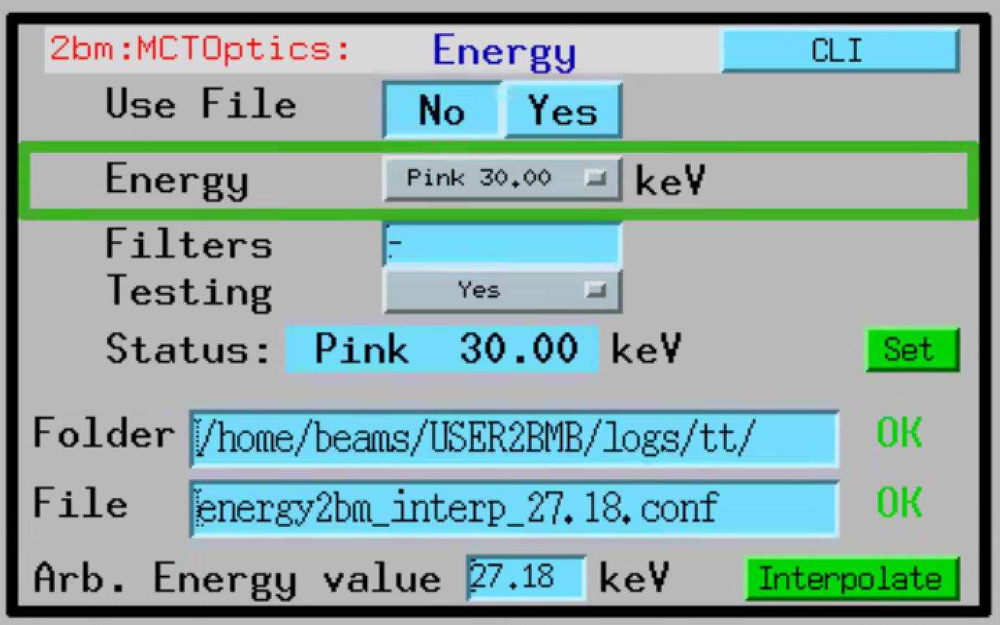
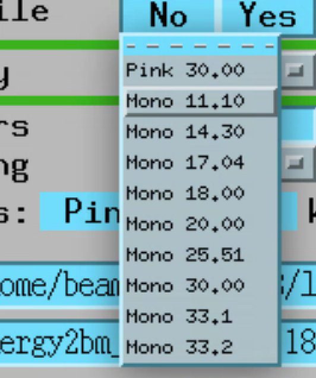
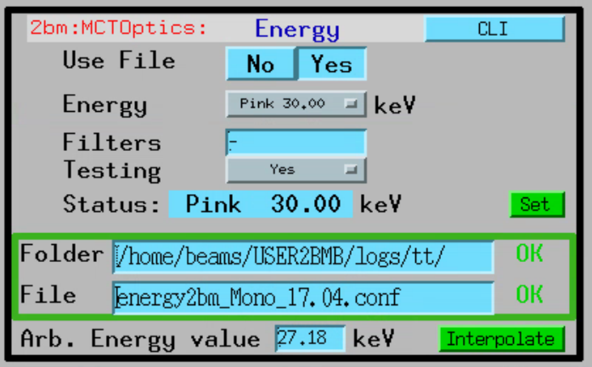
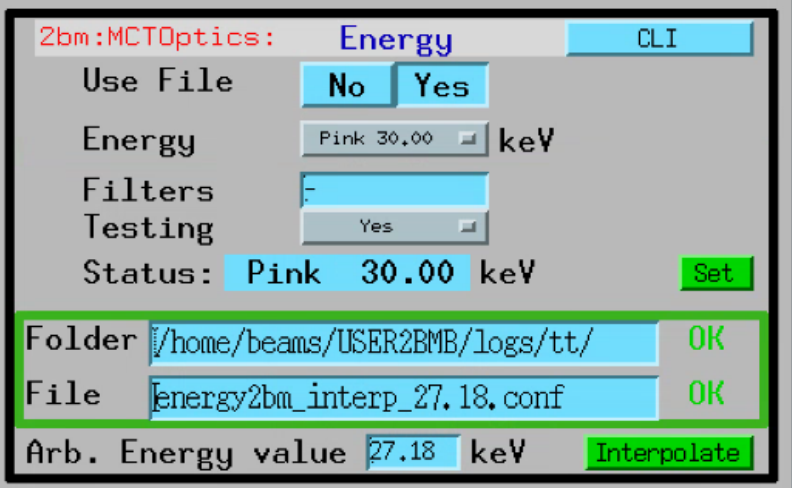

=====
Usage
=====

Objective and camera change can be accomplished by simply selecting the desired magnification and the camera in the user interface selector of the main **mctOptics** control screen:

.. image:: img/mctOptics.png 
   :width: 720px
   :align: center
   :alt: tomo_user

When changing lens/camera, **mctOptics** is also correcting for minor miss-alignment of the instrument visible light optics so that sample point of interest stays in the
center of the image at each lens change. **mctOptics** also keeps the rotation axis aligned with the detector columns and each lens/camera change by rotating the camera.

This capability allows for step-zoom-in during a tomographic measurement and shown in `this video <https://anl.box.com/s/7zr8oij9lavq7o7ylymy6qpbxqw1sz19>`_

The required lens offset sample x, y, z and the lens offset camera rotation are very reproducible and can be determined once when the instrument is first installed.

Energy change
=============

The beamline x-ray energy change is managed by the `energy cli <https://github.com/xray-imaging/energy>`_ python library. 

For user operation the **energy cli** is called from the `mctOptics user interface <https://mctoptics.readthedocs.io/en/latest/index.html>`_:

.. image:: img/dmm_03.png 
   :width: 256px
   :align: center
   :alt: tomo_user

The DMM energy change operates in two modes. The first uses pre-stored energy calibration files. To select this mode set to "No" the "Use File" button:

Then you can select any available energy from the drop down list:

Once the desired energy is selected press the "Set" button to move the DMM.

The second mode allows the use of arbitrary configuration files. You can enable this mode by selecting "Yes" in the "Use File" button:

In this example we are setting the DMM to 17.04 keV using the **energy2bm_Mono_17.04.conf** configuration file. Press the "Set" button to move the DMM to this energy.

You can create new configuration files with the `energy cli <https://github.com/xray-imaging/energy>`_ by moving the DMM to a known energy, i.e. using calibration 
foils, and storing that DMM positions in a new config file with:

::

    [user2bmb@arcturus,42,~]$ energy save --mode Mono --energy-value 27.00

in this case a new config file called **energy2bm_Mono_27.0_2022-11-03_23_26_17.conf** is automatically generated and it can be used by updating the "Folder" and "File" entries in the
user iterface.

Finally, if you want to set the DMM to an arbitrary energy that is not a calibration point, let's say 27.18, you can use the "interpolate" function. To do so, enter an abritrary energy 
within the energy calibrated range, in our case between 11.10 and 33.20 keV, in the user inteface. 

The intepolation function will create a config file for 27.18 keV by intepolating linearly all DMM positions between the 2 closest calibrated energies. 
For 27.18 keV, the intepolation will occur using 25.51 and 30.00 keV.  Once the new energy2bm_interp_27.18.conf is generated, its name will be automacally
copied in the "File" entry of the user interface. To move the DMM to this energy press the "Set" button.

More information on how to operate the mctOptics user inteface is `here <https://mctoptics.readthedocs.io/en/latest/usage.html>`_.
