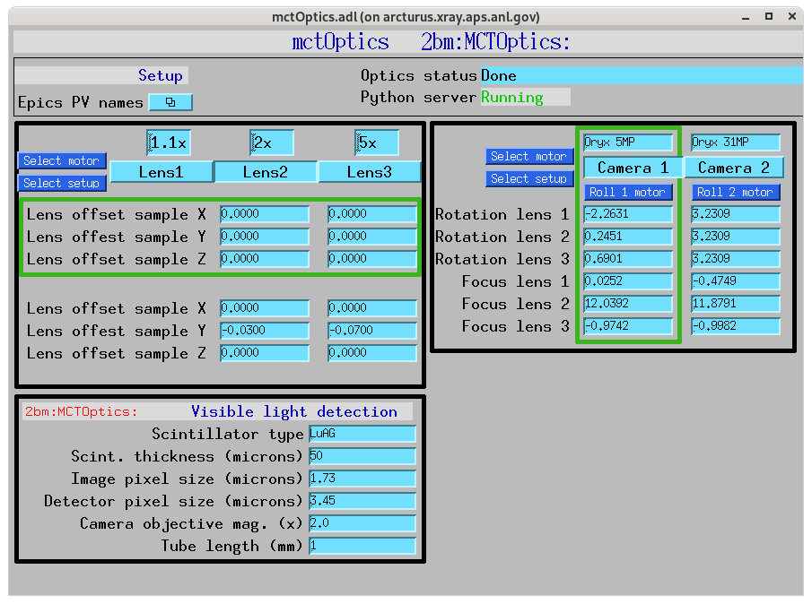

=========
mctOptics
=========

mctOptics is an EPICS IOC supporting the the Optique Peter systen installed at beamline 2-BM of the Advanced Photon Source.

docs: https://mctoptics.readthedocs.io

Usage
=====

To select a specific lens/detector combination simply press the desired option in the maim mctOptics control screen:

After the selection is completed the corresponding TomoScan information at:

.. image:: docs/source/img/tomoScan.png
    :width: 30%
    :align: center

are updated and stored in the hdf projection data file.